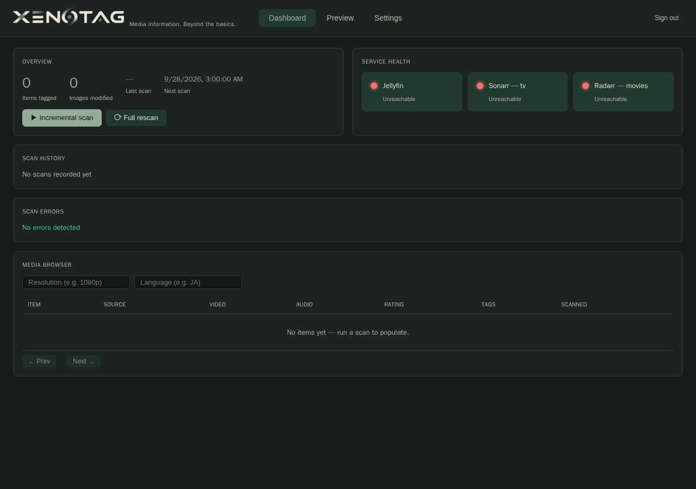
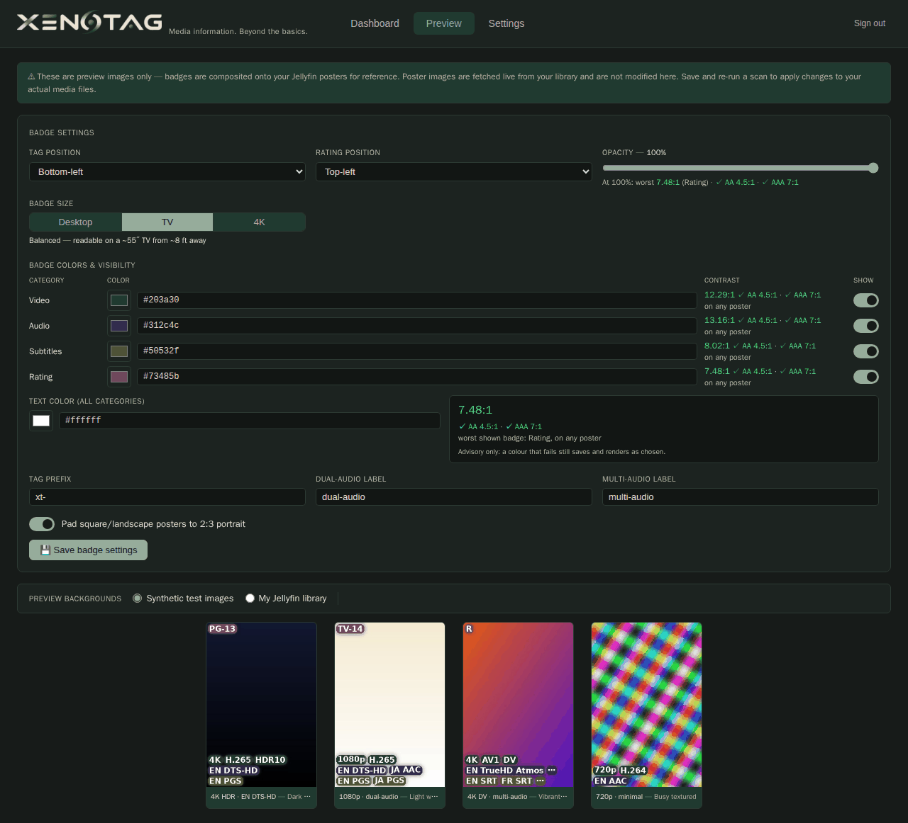
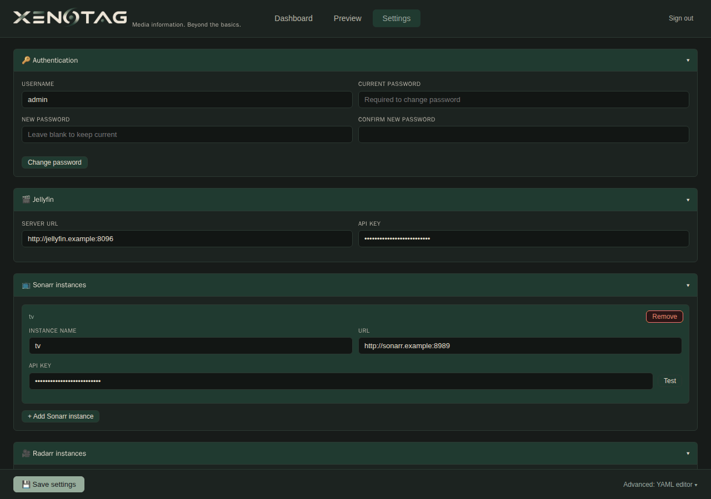

# Xenotag

[](https://github.com/bpoulliot/xenotag/actions/workflows/ci.yml)
[](https://github.com/bpoulliot/xenotag/actions/workflows/codeql.yml)
[](https://github.com/bpoulliot/xenotag/pkgs/container/xenotag)

Xenotag scans your Jellyfin library, extracts resolution, codec, HDR, and audio language metadata from media files via `ffprobe`, and writes that metadata back as tags in Jellyfin — and in Sonarr and Radarr once you switch those writes on (they ship as a dry run). It also overlays badge pills directly onto poster images so your library art shows resolution, format, and language at a glance — no manual tagging required.

---

> **Mount Point Requirement**
>
> Every volume path mounted into the Xenotag container **must be identical** to the path
> Jellyfin uses inside its own container. If Jellyfin sees movies at `/data/movies`, Xenotag
> must also mount and access them at `/data/movies`. Mismatched paths cause all file-level
> lookups to fail silently — media will be scanned but poster images will not be updated and
> `ffprobe` will be unable to read files. This applies to every media mount in every container.

---

## Examples

Rendered by the real overlay code over synthetic backgrounds, at the shipped defaults
(regenerate with `python3 scripts/generate_readme_images.py`):

| Desktop | TV (default) | 4K | Rating and tags in one corner |
|:---:|:---:|:---:|:---:|
|  |  |  |  |
| `badge_size: desktop` — subtle, for viewing up close | `badge_size: tv` — readable on a TV from across the room | `badge_size: tv_plus` — for large screens and far seating | `rating_position` = `badge_position`: the two stack, rating nearest the corner |


*Dashboard: tagged-item and modified-image counts, next scheduled scan, service health, scan history and the media browser (a fresh install on placeholder URLs, hence no items).*


*Preview: badge position, size, colours and opacity, with each colour's rendered contrast and live previews over synthetic posters.*


*Settings: credentials, Jellyfin and each Sonarr/Radarr instance, with a YAML editor for everything else.*

---

## Features

### Metadata Extraction
- Extracts **resolution** (480p, 720p, 1080p, 4K), **video codec** (H.264, H.265/HEVC, AV1, VP9, etc.), and **HDR type** (HDR10, HDR10+, Dolby Vision, HLG) via `ffprobe`
- A **resolution class** is reached when the video's width *or* height is within 5% of the class's: 3840×2160 (4K), 1920×1080 (1080p), 1280×720 (720p) — so a 3836×1604 scope crop or a 3584×2160 open matte is 4K, and a 1440×1080 frame is 1080p. 480p is width alone (≥ 812, i.e. 854 less 5%), so DVD frames (720×480, 720×576) are SD
- Tags **interlaced** video `xt-interlaced` when ffprobe's field order says so (`tt`/`bb`/`tb`/`bt`). There is no progressive tag, and a stream that declares no field order is not tagged either way — common: about a third of a sampled library, mostly AV1 and HEVC. Tag only, no badge
- Extracts **audio track languages** and **codecs** (TrueHD, DTS-HD, AC-3, AAC, etc.)
- Extracts **subtitle track languages** and formats (PGS, SRT, ASS, embedded vs. external)
- Reads **content rating** from Jellyfin; optionally falls back to the matched Sonarr/Radarr certification (off by default)

### Tag Writing
- Writes `xt-*` prefixed tags to **Jellyfin**, and to **Sonarr** and **Radarr** once `arr_sync.mode` is `live` — until then the *arr side is a dry run that only counts
- Supports multiple Sonarr and Radarr instances (separate 4K/HD instances, etc.): each item is matched to its series/movie inside each instance by TVDB/TMDB/IMDb id **and** folder
- Configurable tag prefix, dual-audio tag, and multi-audio tag
- Per-destination tag routing — send video tags only to Jellyfin, audio tags only to Sonarr, etc.
- Preserves existing user-defined tags; only manages its own prefixed set
- `xt-*` tags are owned by Xenotag: a hand edit to one is replaced the next time Xenotag writes that item. Before the write it logs a `Tag drift` WARNING naming the item and the `xt-` tags that differ from what it last wrote (counted in `xenotag_tag_drift_total`)
- A Jellyfin tag write is read back before it is recorded: a write Jellyfin undid is made once more, and if it is still wrong Xenotag logs a `Tag write did not stick` WARNING (counted in `xenotag_tag_writeback_mismatch_total`) and records what Jellyfin has. A write that fails is not recorded, so the next scan retries it
- Notices items Jellyfin no longer has: reports the stale index rows and the managed tags left on their Sonarr/Radarr series/movie, and removes them once `deleted_items.mode` is `remove` (ships report-only)

### Poster Badge Overlay
- Overlays **pill-shaped badges** directly onto poster/folder images
- **Video badges**: resolution, codec, HDR type in a single grouped pill
- **Audio badges**: codec-first grouping — `DTS-HD EN JA` instead of separate pills per language
- **Subtitle badges**: format-first grouping — `PGS EN JA IT`, `SRT EN`
- **Rating badge**: content rating in its own corner (`image.rating_position`, default top-left); sharing a corner with the other badges stacks them instead of overlapping
- Badge position configurable: bottom-left, bottom-right, top-left, top-right
- Configurable opacity, font size, badge colors per group (video, audio, subtitle, rating)
- Long language lists truncate gracefully with `…` rather than overflowing the poster edge
- Automatic portrait padding for square or landscape source images (blurred edge-fill extension)
- Original posters are backed up with a `.orig` suffix before the first overlay

### Scanning
- **Full scan**: re-processes every item in the library
- **Incremental scan**: skips files whose mtime hasn't changed since last scan — runs in seconds on large libraries after initial full scan
- **Webhook-triggered scan**: single-item processing on Sonarr, Radarr, or Jellyfin download/import events
- **Scheduled scans**: configurable cron expression (default: weekly)
- Parallel `ffprobe` via configurable worker pool (`scan.max_workers`)
- Path filters: limit scanning to specific mount prefixes
- Tag config change detection: automatically forces a full re-tag when tag settings change, or when an upgrade changes how tags are spelled or how a file's resolution is classed (that first scan re-probes every file and rewrites the changed tags on Jellyfin and on every live Sonarr/Radarr)
- Per-item error tracking: probe failures, missing files, process errors — visible in the dashboard

### Web UI
- **Dashboard**: stats summary, last scan details, health status for all connected services
- **Live scan log**: real-time SSE stream of scan progress with percentage bar and current item
- **Scan history**: per-scan records with runtime, items scanned/tagged/errored
- **Scan errors table**: live-refreshing during active scans; full file path, item ID, error type
- **Media browser**: paginated table filterable by resolution and language
- **Badge preview**: render overlay against synthetic test posters or live Jellyfin artwork using your current color/opacity/position settings
- **Contrast warning**: beside each badge colour and the opacity slider, the label's contrast as the badge actually *renders* — the worst case over black, white and grey posters, against your text colour — with WCAG AA (4.5:1) and AAA (7:1) marked. Advisory only: a colour that fails still saves and renders as chosen
- **Settings editor**: full config editor with live preview; change password; reschedule scans
- **Cancel button**: interrupt a running scan between phases

### Security
- Session cookies: HttpOnly, SameSite=lax, 30-day expiry, `Secure` flag on by default
- Cross-origin request check: a `POST`/`PUT`/`PATCH`/`DELETE` whose `Origin` header (or, without one, `Referer`) is not Xenotag's own origin gets a 403. This closes the gap `SameSite=lax` leaves: behind a reverse proxy, every other app on the same parent domain counts as the same *site*.
  - **Behind a reverse proxy**, "own origin" is read from `X-Forwarded-Proto` and `X-Forwarded-Host` (then `Host`, then `X-Forwarded-Port`). The proxy must pass them through. SWAG's stock `proxy.conf` does. A proxy that rewrites `Host` to the upstream name and sends no `X-Forwarded-Host` will make every save fail with 403, and the log line `Rejected cross-origin … is not this request's origin …` shows what Xenotag computed.
  - **A request with neither header is allowed.** Browsers always send `Origin` on a cross-origin `POST`, so such a request comes from a non-browser client (a script, `curl`). It still needs a valid session cookie wherever it did before.
  - `/webhook/*` is exempt, because *arr and Jellyfin post there server-to-server
- Rate-limited login: 10 attempts/minute per IP
- bcrypt password hashing (12 rounds), minimum 12-character passwords
- Security headers on every response: CSP, X-Frame-Options, X-Content-Type-Options, Referrer-Policy, X-XSS-Protection
- Changing password immediately invalidates all existing sessions
- Rotate `auth.secret_key` to force-invalidate all sessions without a password change
- Secrets can be supplied by the environment (including Docker file-secrets), and each Sonarr/Radarr instance can read its key from a file; either way they are never written to `config.yml` — see [Externally managed secrets](#externally-managed-secrets)

---

## Quick Start (Docker)

**1. Pull from GitHub Container Registry:**

```bash
docker pull ghcr.io/bpoulliot/xenotag:latest
```

**2. Create a config directory and copy the example config:**

```bash
mkdir -p ./config
cp config.example.yml ./config/config.yml
```

**3. Edit `config/config.yml`:**

- Set `jellyfin.url` and `jellyfin.api_key` (Dashboard → Advanced → API Keys)
- Add Sonarr/Radarr instances under `sonarr.instances` / `radarr.instances` (optional)
- Leave `auth.password_hash` empty — credentials are auto-generated on first boot and printed to the container log

**4. Configure `docker-compose.yml`:**

```yaml
services:
  xenotag:
    image: ghcr.io/bpoulliot/xenotag:latest
    container_name: xenotag
    volumes:
      - ./config:/config
      # Mirror your Jellyfin volume mounts exactly:
      - /path/to/media/movies:/path/to/media/movies:rw
      - /path/to/media/tv:/path/to/media/tv:rw
    ports:
      - "127.0.0.1:7755:7755"
    restart: unless-stopped
```

**5. Start:**

```bash
docker compose up -d
```

Open `http://localhost:7755`. On first boot, auto-generated credentials are printed to the container log:

```bash
docker logs xenotag | grep -A4 "FIRST RUN"
```

---

## Configuration Reference

All settings live in `/config/config.yml`. Secrets can instead be supplied by the environment —
see [Externally managed secrets](#externally-managed-secrets).

### Jellyfin

| Key | Type | Default | Description |
|---|---|---|---|
| `jellyfin.url` | string | `http://jellyfin:8096` | Jellyfin base URL |
| `jellyfin.api_key` | string | `""` | Jellyfin API key — can be supplied by the environment instead, see [Externally managed secrets](#externally-managed-secrets) |
| `jellyfin.library_ids` | list | `[]` | Library IDs to scan; empty = all libraries |

### Sonarr / Radarr

```yaml
sonarr:
  instances:
    - name: sonarr
      url: http://sonarr:8989
      api_key: ""
    - name: sonarr-4k         # multiple instances supported
      url: http://sonarr-4k:8989
      api_key_file: /run/secrets/sonarr_4k   # or read the key from a file

radarr:
  instances:
    - name: radarr
      url: http://radarr:7878
      api_key: ""
```

Each instance's key can be read from a file instead (`api_key_file`); it is then never written to
`config.yml` — see [Externally managed secrets](#externally-managed-secrets).

### Sonarr / Radarr writes

| Key | Type | Default | Description |
|---|---|---|---|
| `arr_sync.mode` | string | `"dry_run"` | `dry_run`: match every item and record what *would* be written; the Sonarr/Radarr clients are built on a transport that refuses anything but GET. `live`: write the managed tags and create missing tag labels. |
| `arr_sync.certification_fallback` | bool | `false` | Fill a blank Jellyfin rating from the matched series/movie's certification. This writes to **Jellyfin** (the rating field, and the rating tag/badge wherever `tags.destinations.rating` sends them). |

An item is matched to a series/movie **inside each instance** by its TVDB/TMDB/IMDb id, and the
match must also agree on the folder — the *arr object's `path` must be the Jellyfin item's folder.
That is what keeps the HD and the 4K copy of a title (same id, two instances) from receiving each
other's tags, and it assumes the *arrs see media at the same paths Jellyfin does (the same
requirement as the mount-point note above). Ids that point at two titles, and a title two items
claim, are refused and reported. Writes go through the *arr's bulk editor (`applyTags`
add/remove, managed tags only), which changes nothing else; every write is read back, and a
mismatch halts further writes for that scan.

To go live: run the dry run first (Settings → **Sonarr / Radarr writes** → **Run dry run now**, or
`python -m app.arr_sync --dry-run --db /config/state.db` inside the container), then set
**Tag writes → Live**. Turning either switch on forces the next scan to be a full re-tag.
Switching back to dry run stops writes but removes nothing already written. Radarr accepts only
`a-z`, `0-9` and `-` in a label, so tags are spelled to be legal everywhere: `.` is dropped, `+`
becomes `plus` and a space `-` (`xt-H264`, `xt-DDplus-Atmos`, `xt-HDR10plus`; the \*arrs store
them lowercased). Badge text keeps the display names (`H.264`, `DD+ Atmos`). A label Radarr would
still refuse is skipped there and listed in the report.

### Deleted items

| Key | Type | Default | Description |
|---|---|---|---|
| `deleted_items.mode` | string | `"report"` | `report`: every scan works out which index rows and which *arr tags belong to items Jellyfin no longer has, and changes nothing — the index is opened read-only and the Sonarr/Radarr clients are built on a transport that refuses anything but GET. `remove`: delete those rows and strip the managed tags (the tags only while `arr_sync.mode` is `live`). |
| `deleted_items.max_fraction` | float | `0.15` | Removal refuses when more than this share of the index would go at once; the report still lists everything. |

An item is gone only when a **complete** Jellyfin listing lacks it (the pages must add up to the
server's `TotalRecordCount` and a recount must agree) **and** a lookup by id does not find it —
beside live control items that must answer, or the pass is aborted and changes nothing. An item
Jellyfin still lists but the scan cannot read (file gone, probe failed) is never "gone". Its
series/movie is found by **folder**, the rule the *arr writes use: the object whose path is the
folder the scan recorded for the item. An object whose folder still holds a live Jellyfin item is
never stripped — that item owns it now (a re-encode that replaced the file is the common case).
Each strip removes managed tags only, is read back like any *arr write (a mismatch halts the
pass), and is appended to `deleted-items-removed.jsonl` beside `state.db`, so it can be undone;
a row is deleted only after its object was stripped. Read the report first (Settings →
**Deleted items** → **Run report now**, which is always report-only, or
`python -m app.deleted_items --report --db /config/state.db` inside the container), then set
`deleted_items: {mode: remove}`. The mode is not part of the tag configuration, so switching it
forces no re-tag.

### Scanning

| Key | Type | Default | Description |
|---|---|---|---|
| `scan.schedule` | string | `"0 3 * * *"` | Cron expression for automatic scans; empty = manual only |
| `scan.incremental` | bool | `true` | Skip files unchanged since last scan |
| `scan.path_filters` | list | `[]` | Only scan paths matching these prefixes; empty = all |
| `scan.max_workers` | int | `4` | Parallel `ffprobe` workers; lower for slow/spinning disks |

### Tags

| Key | Type | Default | Description |
|---|---|---|---|
| `tags.managed_prefix` | string | `"xt-"` | Prefix for all tags written by Xenotag |
| `tags.legacy_prefixes` | list | `["mf-"]` | Prefixes from an earlier install to strip on sight — from the media server on every write, and from the local index at startup. A tag carrying `managed_prefix` is never stripped, even if a legacy prefix also matches it. |
| `tags.dual_audio_tag` | string | `"dual-audio"` | Tag applied when exactly 2 audio languages detected |
| `tags.multi_audio_tag` | string | `"multi-audio"` | Tag applied when 3+ audio languages detected |
| `tags.destinations.video` | list | `["poster","jellyfin","sonarr","radarr"]` | Which destinations receive video tags (resolution, codec, HDR, `interlaced`; the poster shows no badge for `interlaced`) |
| `tags.destinations.audio` | list | `["poster","jellyfin","sonarr","radarr"]` | Which destinations receive audio tags |
| `tags.destinations.subtitles` | list | `["poster","jellyfin"]` | Which destinations receive subtitle tags |
| `tags.destinations.rating` | list | `["poster"]` | Which destinations receive rating tags |

### Image Overlay

| Key | Type | Default | Description |
|---|---|---|---|
| `image.targets` | list | `[poster.jpg, ...]` | Poster filenames to search for in each item folder |
| `image.backup_suffix` | string | `".orig"` | Suffix appended to original poster backups |
| `image.badge_position` | string | `"bottom-left"` | Main badge group position: `bottom-left`, `bottom-right`, `top-left`, `top-right`. |
| `image.rating_position` | string | `"top-left"` | Content-rating badge corner, same four values. If it matches `badge_position` the two stack, rating nearest the corner; on the same edge but opposite sides, the badge row beside the rating is shortened so the two never touch. An unrecognised value falls back to `top-left` with a warning. |
| `image.badge_opacity` | float | `1.0` | Badge fill opacity (0.0–1.0). This is a contrast control: below `1.0` the poster shows through the badge and the label's rendered contrast drops below the figure quoted for each colour. With the shipped palette, `0.98` is the floor for WCAG AAA and `0.80` for AA — the palette trades contrast headroom for colour-blind separation, so there is little room below `1.0` — the Badge settings page shows the rendered figure as you move the slider, and `scripts/measure_badge_contrast.py` prints the same numbers. |
| `image.badge_size` | string | `"tv"` | Base font size tier: `desktop`, `tv`, `tv_plus` |
| `image.normalize_portrait` | bool | `true` | Pad square/landscape images to 2:3 portrait ratio |
| `image.show_video_badges` | bool | `true` | Render video group badge |
| `image.show_audio_badges` | bool | `true` | Render audio group badge |
| `image.show_sub_badges` | bool | `true` | Render subtitle group badge |
| `image.show_rating_badge` | bool | `true` | Render content rating badge |
| `image.video_badge_color` | string | `"#203a30"` | Video badge fill color (hex) |
| `image.audio_badge_color` | string | `"#312c4c"` | Audio badge fill color (hex) |
| `image.sub_badge_color` | string | `"#50532f"` | Subtitle badge fill color (hex) |
| `image.rating_badge_color` | string | `"#73485b"` | Rating badge fill color (hex) |
| `image.badge_palette_version` | int | `2` | Internal: which default palette this config has been migrated to. Leave it alone — it is what stops the migration re-running over a colour you chose. |
| `image.badge_text_color` | string | `"#ffffff"` | Badge text color (hex) |

The five colour keys accept anything Pillow reads as a plain RGB colour — `#rrggbb`, `#rgb`, a colour name such as `red`, `rgb(255,0,0)` — and store it as `#rrggbb`. A colour with an alpha channel (`#rrggbbaa`, `rgba(…)`) is not accepted, because opacity is `badge_opacity`'s job. An unreadable colour in `config.yml` falls back to that key's default with a warning in the log; saving one from Settings or the raw YAML editor is refused.

### Auth

| Key | Type | Default | Description |
|---|---|---|---|
| `auth.username` | string | `"admin"` | Login username |
| `auth.password_hash` | string | `""` | bcrypt hash; leave empty for auto-generation on first boot |
| `auth.secret_key` | string | `""` | HMAC signing secret for sessions; auto-generated if empty. Can be supplied by the environment instead, see [Externally managed secrets](#externally-managed-secrets) |

### Other

| Key | Type | Default | Description |
|---|---|---|---|
| `log_level` | string | `"INFO"` | Logging verbosity: `DEBUG`, `INFO`, `WARNING`, `ERROR` |

---

## Environment Variables

| Variable | Description |
|---|---|
| `XENOTAG_USERNAME` | Initial admin username — **seeds** `config.yml` on first boot only, when no credentials exist yet |
| `XENOTAG_PASSWORD` | Initial admin password (min 12 chars) — first boot only, same as above |
| `SECURE_COOKIES` | Set to `false` when running over plain HTTP without a reverse proxy |
| `CONFIG_PATH` | Path to config file inside the container (default: `/config/config.yml`) |

For the variables that **override** a config value on every boot, see below.

---

## Externally managed secrets

`config.yml` is read-write application state: saving the Settings page rewrites the whole file.
That makes it a poor home for a secret rendered by an outside pipeline — the next save would
clobber it. So the environment can own individual **fields** instead of the file.

| Config field | Variable | File variant |
|---|---|---|
| `jellyfin.api_key` | `JELLYFIN_API_KEY` | `JELLYFIN_API_KEY_FILE` |
| `auth.secret_key` | `XENOTAG_SECRET_KEY` | `XENOTAG_SECRET_KEY_FILE` |
| `webhooks.secret` | `XENOTAG_WEBHOOK_SECRET` | `XENOTAG_WEBHOOK_SECRET_FILE` |

When one of these is set:

- it **overrides** whatever `config.yml` holds, on every boot and on every save;
- Xenotag **never writes that field back** to `config.yml`, from the Settings page, the raw YAML
  editor, or the first-run bootstrap;
- the Settings page shows the field read-only, labelled as externally managed;
- startup logs which fields the environment supplied, **by name** — never by value.

The `_FILE` variant names a path to read the value from — the Docker file-secret convention — and
**takes precedence** when both are set. The file form is what a secrets pipeline writes on
purpose; a bare variable is the form that arrives by accident, from a shared compose `env_file`
or an inherited shell environment. When both are present, the deliberate source wins.

```yaml
services:
  xenotag:
    environment:
      - JELLYFIN_API_KEY_FILE=/run/secrets/xenotag_jellyfin_api_key
    secrets:
      - xenotag_jellyfin_api_key

secrets:
  xenotag_jellyfin_api_key:
    file: ./secrets/xenotag_jellyfin_api_key
```

**Failure behaviour is deliberately asymmetric,** because an override that is silently ignored is
worse than no override — it makes you believe a secret rotated when it did not.

- `<VAR>_FILE` set but unreadable, or naming an empty file: **startup fails.** Naming a file is
  unambiguous intent; carrying on with the stale value in `config.yml` is the exact silent
  failure this feature exists to prevent.
- `<VAR>` set to an empty string: **ignored, with a warning.** Empty is the signature of an
  unpopulated `${VAR}` interpolation, not of intent, and blanking a working key on that basis
  would take the deployment down.

Not overridable: `auth.password_hash` (a verifier, not a secret — the first-run bootstrap
has to be able to write it).

### Sonarr / Radarr instance keys

The instance keys live in a list (`sonarr.instances`, `radarr.instances`), which a variable name
cannot address reliably — an index breaks when an instance is reordered, a name when it is
renamed. So each instance names **its own key file** instead:

```yaml
sonarr:
  instances:
    - name: sonarr-4k
      url: http://sonarr-4k:8989
      api_key_file: /run/secrets/sonarr_4k
```

```yaml
services:
  xenotag:
    secrets:
      - sonarr_4k

secrets:
  sonarr_4k:
    file: ./secrets/sonarr_4k
```

When an instance has `api_key_file`, the same rules as the table above apply to its key:

- the file supplies the key on every boot and every save, and **wins** over an `api_key` beside it;
- Xenotag **never writes that instance's `api_key`** to `config.yml` — from the Settings page, the
  raw YAML editor, or the first-run bootstrap. The path itself is not a secret and is saved;
- a file that is unreadable or empty **fails startup** (and refuses a save) — there is no
  "ignored with a warning" case, because a set `api_key_file` is always deliberate;
- the Settings page shows that instance's key read-only, labelled as externally managed. Its
  **Test** button sends the key read from the file; it never reads a path that `config.yml` does
  not already name. To add, change or remove a path, use the raw YAML editor;
- startup logs each file-backed instance **by name and path** — never by value.

Because the binding lives in the instance itself, reordering or renaming an instance cannot
detach it from its key. A rotated file is picked up at the next restart or Settings save.

Use a **separate** Jellyfin API key for Xenotag rather than sharing one across your stack. A
per-consumer key rotates and revokes independently, and Jellyfin's API key list then doubles as a
record of what has access.

Enabling an override or an `api_key_file` does not rewrite `config.yml` — loading never writes.
A value already in the file (a Jellyfin key, or an instance's old `api_key`) is removed by the
next save (open Settings and save once), or delete the key by hand.

---

## Webhook Integration

Xenotag can process a single item immediately when Sonarr, Radarr, or Jellyfin fires a download/import event.

**Endpoint:** `POST /webhook/{source}` where `{source}` is `sonarr`, `radarr`, or `jellyfin`

Configure the webhook URL in your *arr application's Connect settings. Xenotag will resolve the Jellyfin item, run `ffprobe`, apply tags, and update the poster overlay — all within seconds of the download completing.

---

## API Endpoints

| Method | Path | Auth | Description |
|---|---|---|---|
| GET | `/health` | No | Service info unauthenticated; full upstream connectivity when authenticated |
| GET | `/metrics` | No | Prometheus metrics — see [Prometheus metrics](#prometheus-metrics) |
| GET | `/stats` | Yes | Scan statistics and next scheduled run time |
| POST | `/scan/full` | Yes | Trigger a full library scan |
| POST | `/scan/incremental` | Yes | Trigger an incremental scan |
| POST | `/scan/cancel` | Yes | Cancel a running scan |
| GET | `/scan/status` | Yes | Current scan progress (total, done, running, current item) |
| GET | `/scan/stream` | Yes | SSE stream of live scan log lines |
| GET | `/api/scan-errors` | Yes | All scan errors (probe failures, missing files) |
| DELETE | `/api/scan-errors` | Yes | Clear all scan errors |
| GET | `/api/scan-runs` | Yes | Recent scan run records |
| GET | `/api/legacy-tags` | Yes | Dry run: what a legacy-prefix sweep would remove from the local index |
| DELETE | `/api/legacy-tags` | Yes | Apply the legacy-prefix sweep to the local index |
| GET | `/media` | Yes | Paginated media browser (filter by resolution, language) |
| GET | `/api/settings` | Yes | Structured settings (password_hash redacted) |
| PUT | `/api/settings` | Yes | Save settings |
| POST | `/api/auth/change-password` | Yes | Change login password |
| GET | `/config` | Yes | Raw YAML config |
| PUT | `/config` | Yes | Save raw YAML config |
| GET | `/api/jellyfin/libraries` | Yes | List Jellyfin libraries |
| GET | `/api/sonarr/{name}/rootfolders` | Yes | List Sonarr root folders |
| GET | `/api/radarr/{name}/rootfolders` | Yes | List Radarr root folders |
| GET | `/api/preview/sample-posters` | Yes | Poster sources for badge preview |
| GET | `/preview/image` | Yes | Render a preview badge overlay image |
| GET | `/api/badge-contrast` | Yes | Rendered WCAG contrast of the badge colours being chosen (same query parameters as `/preview/image`) |
| GET | `/api/arr-sync/report` | Yes | The last Sonarr/Radarr sync report (from a scan or a dry run) |
| POST | `/api/arr-sync/dry-run` | Yes | Start a read-only dry run: match every item and count what a live sync would write |
| GET | `/api/deleted-items/report` | Yes | The last deleted-items report (from a scan or a manual report) and the configured mode |
| POST | `/api/deleted-items/report` | Yes | Start a deleted-items report — always report-only, whatever `deleted_items.mode` says |
| POST | `/webhook/{source}` | No* | Trigger single-item processing from *arr/Jellyfin webhook |

*Webhook endpoint needs no session, so that *arr's built-in webhook delivery works. When `webhooks.secret` is set it requires that token, as `?token=` or an `X-Webhook-Token` header.

Every `POST`/`PUT`/`DELETE` above except `/webhook/{source}` is also subject to the [cross-origin check](#security).

---

## Prometheus metrics

`GET /metrics` serves the Prometheus text format, with no session — scrape it over your Docker
network, and keep the public hostname behind your proxy's auth. It carries counts and timestamps
only: no item names, paths or secrets.

| Metric | Type | Labels | Meaning |
|---|---|---|---|
| `xenotag_build_info` | gauge | `version` | Always 1 |
| `xenotag_scan_running` | gauge | | 1 while a scan holds the scan lock |
| `xenotag_scans_total` | counter | `scan_type`, `outcome` | Scans finished; `outcome` = `success` / `failed` / `cancelled` |
| `xenotag_scan_last_success_timestamp_seconds` | gauge | | When the last scan completed |
| `xenotag_scan_last_failure_timestamp_seconds` | gauge | | When the last scan failed (0 = none since start) |
| `xenotag_scan_last_duration_seconds` | gauge | | Wall time of the last successful scan |
| `xenotag_scan_last_items_scanned` / `_items_tagged` / `_images_modified` | gauge | | The last successful scan's counts |
| `xenotag_scan_errors_total` | counter | `error_type` | Per-item errors: `no_path`, `no_file`, `probe_failed`, `process_error` (or `other`) |
| `xenotag_arr_tag_writes_total` | counter | `arr_instance`, `result` | Live Sonarr/Radarr writes: `written` / `error` / `readback_mismatch` |
| `xenotag_arr_halts_total` | counter | | Times live \*arr writes halted |
| `xenotag_arr_sync_halted` | gauge | | 1 from a halt until a later **live** scan syncs without one |
| `xenotag_arr_last_halt_timestamp_seconds` | gauge | | When the last halt happened |

Plus the standard `process_*` and `python_*` series. A failed scan is one that could not list
Jellyfin or raised; items that error inside a scan are counted in `xenotag_scan_errors_total`
and do not fail it.

**After a restart** the last completed scan is read back from `state.db`, and a halt from the
stored \*arr sync report, so a redeploy does not look like "never scanned". A failure is not
stored anywhere and is forgotten by a restart. A halt stays set until a live scan finishes its
\*arr sync cleanly — a dry run, a cancelled scan or a webhook does not clear it.

Metrics are **single-process** by design: xenotag runs one uvicorn worker, and it removes
`PROMETHEUS_MULTIPROC_DIR` from its environment rather than switch on `prometheus_client`'s
multiprocess mode (which writes a file per process that nothing here would ever prune).

Example alerts:

```yaml
- alert: XenotagNoSuccessfulScan
  expr: time() - xenotag_scan_last_success_timestamp_seconds > 26 * 3600
- alert: XenotagLastScanFailed
  expr: xenotag_scan_last_failure_timestamp_seconds > xenotag_scan_last_success_timestamp_seconds
- alert: XenotagArrSyncHalted
  expr: xenotag_arr_sync_halted == 1
```

---

## Integrating with an Existing *arr Stack

Attach Xenotag to your existing Docker Compose network:

```yaml
services:
  xenotag:
    image: ghcr.io/bpoulliot/xenotag:latest
    networks:
      - your_existing_network   # same network as Jellyfin/Sonarr/Radarr

networks:
  your_existing_network:
    external: true
```

Then use container names as hostnames in `config.yml`:

```yaml
jellyfin:
  url: http://jellyfin:8096
sonarr:
  instances:
    - name: sonarr
      url: http://sonarr:8989
```

---

## Development Setup

```bash
# Clone and start the full dev stack (Jellyfin + Sonarr + Radarr + Xenotag with hot-reload)
git clone https://github.com/bpoulliot/xenotag.git
cd xenotag
docker compose -f docker-compose.dev.yml up -d

# UI is at http://localhost:7755
# Default dev credentials: admin / xenotag
```

The dev compose mounts `app/` directly into the container so code changes are picked up immediately (uvicorn `--reload`).

```bash
# Lint and format before committing
pip install ruff black
ruff check app/
black --check app/
```

---

## Database migrations

`state.db`'s schema is versioned by [Alembic](https://alembic.sqlalchemy.org/). The revisions
live in `app/migrations/versions/`, and every start (app, scanner, `python -m app.arr_sync`)
upgrades the database to the newest one before opening it:

- a **new** `state.db` is built from the revisions;
- a `state.db` from a release **before migrations existed** is compared with the baseline
  revision and stamped only if it matches exactly. If it differs, xenotag refuses to start and
  names each difference: restore a backup, or move the file aside to build a fresh index (the
  next scan re-tags everything);
- a `state.db` that a **newer** release has already migrated is left alone, with a warning.

**Rolling back.** An additive migration (a new column or table) leaves the database readable by
an older image: SQLAlchemy ignores the version table and columns it does not know. A
non-additive migration (dropping, renaming or retyping) does not. **Back up `state.db` with its
`-wal` and `-shm` files before upgrading to a release that ships one**, and restore that backup
to roll back.

Adding a revision: see [`app/migrations/README.md`](app/migrations/README.md).
CI runs `python -m app.migrate check`, which fails if the models and the revisions disagree.

---

## CI/CD

Every push and pull request runs:

| Check | Tool |
|---|---|
| Python lint + format | ruff + black |
| Python SAST | bandit |
| Dependency CVE audit | pip-audit |
| Schema drift (models vs migrations) | `alembic check` via `python -m app.migrate check` |
| Dockerfile lint | hadolint |
| Container CVE scan | Trivy (CRITICAL + HIGH, fixed only) |
| Deep Python SAST | CodeQL (weekly + on push/PR to main) |
| PR dependency risk | dependency-review (PRs only) |

Publishing to `ghcr.io/bpoulliot/xenotag` happens automatically on semver tags (`v*.*.*`) via the Release workflow, with SBOM and provenance attestation included.

---

## License

[MIT](LICENSE)
